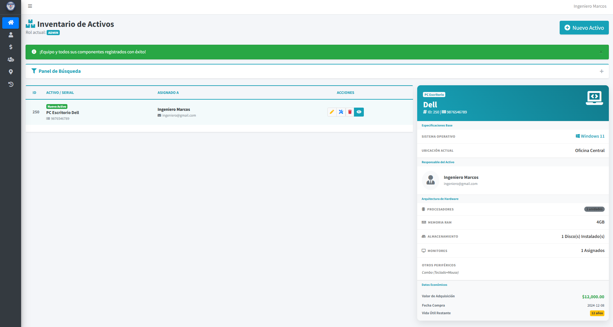
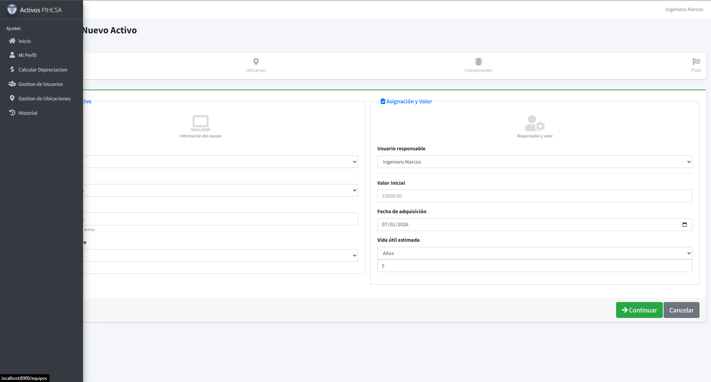
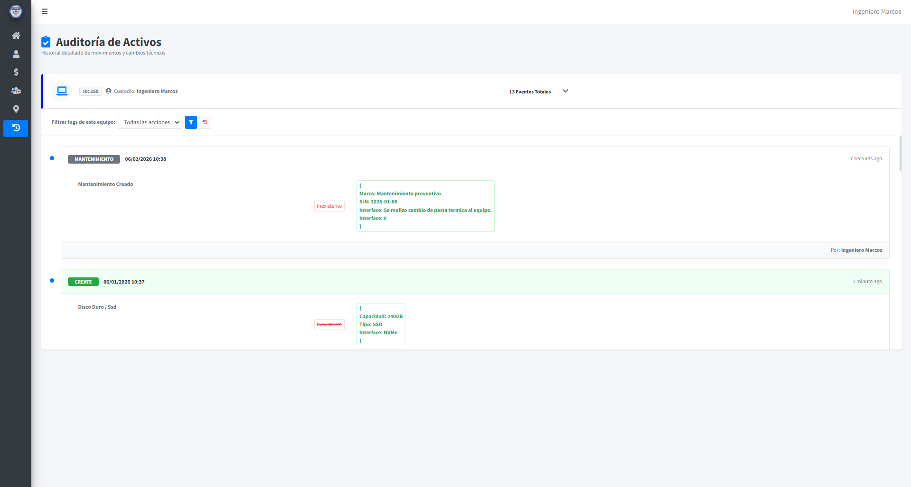

# Gestión de Activos de PIHCSA  
## PIHCSA Asset Management

Sistema de Gestión de Activos de TI desarrollado para **PIHCSA**, enfocado en optimizar el control, registro, seguimiento y auditoría de activos tecnológicos dentro del **sector médico**.

IT Asset Management System developed for **PIHCSA**, focused on optimizing control, registration, tracking, and auditing of technological assets within the **healthcare sector**.

---

## Insignias / Badges

**Tecnología / Technology**  
Laravel v10 · PHP v8.2 · MySQL  

**Estado / Status**  
Build: Passing

---

## Visuales (GIFs)

1. Dashboard principal  

2. Wizard de registro (primer paso)  
   Asset registration wizard (first step)  

3. Historial de movimientos del activo  
   Asset activity and history log  
  

---

## Instalación / Installation

Pendiente.

Esta sección será documentada una vez concluida la configuración final del sistema en un entorno estable.

Pending.

This section will be documented once the system’s final configuration is completed in a stable environment.

---

## Uso / Usage

Al ingresar al sistema, un usuario administrador puede gestionar el **ciclo completo de vida de un activo de TI**, desde su registro inicial hasta su historial de cambios y auditoría.

Upon accessing the system, an administrator can manage the **complete lifecycle of an IT asset**, from initial registration to its full change and audit history.

El sistema garantiza:

- Auditoría completa de cada activo  
- Trazabilidad de asignaciones y componentes  
- Registro histórico de movimientos  
- Control centralizado y consistente de la información  

The system ensures:

- Complete auditability of each asset  
- Traceability of assignments and components  
- Historical record of movements  
- Centralized and consistent data control  

---

## Soporte / Support

Para dudas técnicas relacionadas con la arquitectura, lógica del sistema o implementación:

For technical questions related to architecture, system logic, or implementation:

- Correo / Email: **johanlopezrey1@gmail.com**  
- O bien, abrir un Issue en este repositorio  
- Or open an Issue in this repository  

---

## Contribución / Contribution

Este es un **proyecto privado**, desarrollado específicamente para PIHCSA.

This is a **private project**, developed specifically for PIHCSA.

- No se aceptan Pull Requests externos  
- El código puede ser clonado con fines educativos  

- External Pull Requests are not accepted  
- The code may be cloned for educational purposes  

---

## Autores y Agradecimientos / Authors and Acknowledgements

**Autor / Author**  
Johan Jael López Reyes  
LinkedIn: https://www.linkedin.com/in/johan-lopez-1132802b5/

**Agradecimientos / Acknowledgements**  
A la empresa **PIHCSA** y al **Ing. Marcos Robles** por la oportunidad de colaborar en la solución de un problema real dentro de un entorno profesional.

Special thanks to **PIHCSA** and **Ing. Marcos Robles** for the opportunity to work on solving a real-world problem in a professional environment.

---

Este proyecto forma parte de un proceso de crecimiento técnico y profesional, con enfoque en buenas prácticas, mantenibilidad y experiencia de usuario.

This project is part of a technical and professional growth process, focused on best practices, maintainability, and user experience.

---

<table align="center" border="0">
  <tr>
    <td align="center" valign="center">
      
    </td>
    <td align="center" valign="center">
      
    </td>
    <td align="center" valign="center">
      
    </td>
    <td align="center" valign="center">
      
    </td>
  </tr>
</table>